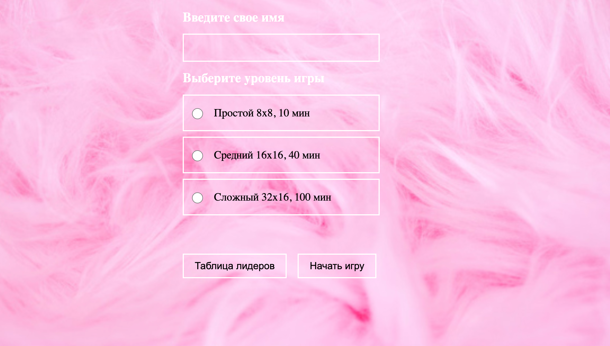
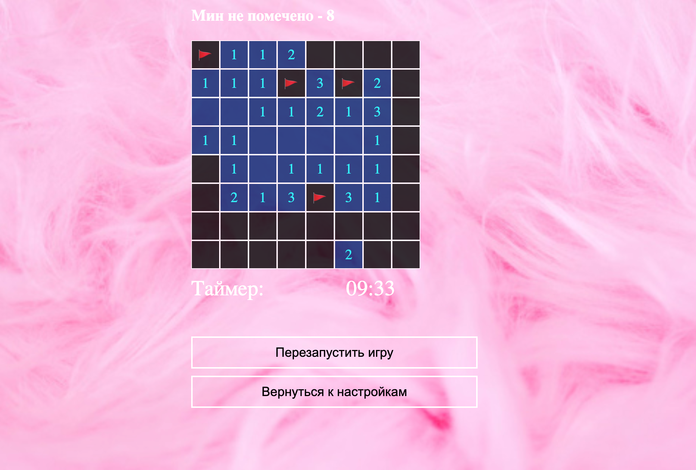

# Игра "Сапер" 
Игра "Сапер", написанная на React.js. Главный экран - страница настроек с выбором сложности и вводом имени. После выбора настроек можно переходить к игре. Результаты сохраняются в local storage, 10 лучших выводятся на странице со списком лидеров. ТЗ [здесь](https://interview.pages.iqdev.digital/react-frontend-developer/)

## Демо
[MineSweeper](https://tamaradzhahparova.github.io/MineSweeper/)

## 🚀 Для запуска проекта необходимо выполнить следующие шаги
6. Склонируй этот репозиторий, выполнив команду: `git clone https://github.com/tamaradzhahparova/MineSweeper.git`;
7. Чтобы перейти в директорию с проекта, после клонирования выполни команду `cd MineSweeper`;
8. Чтобы установить зависимости проекта, выполни команду `npm install`;
9. Чтобы запустить проект в режиме разработки, самое время выполнить  команду `npm run dev`;
 
# Screenshots

- Экран настроек

- Таблица лидеров

- Игра

